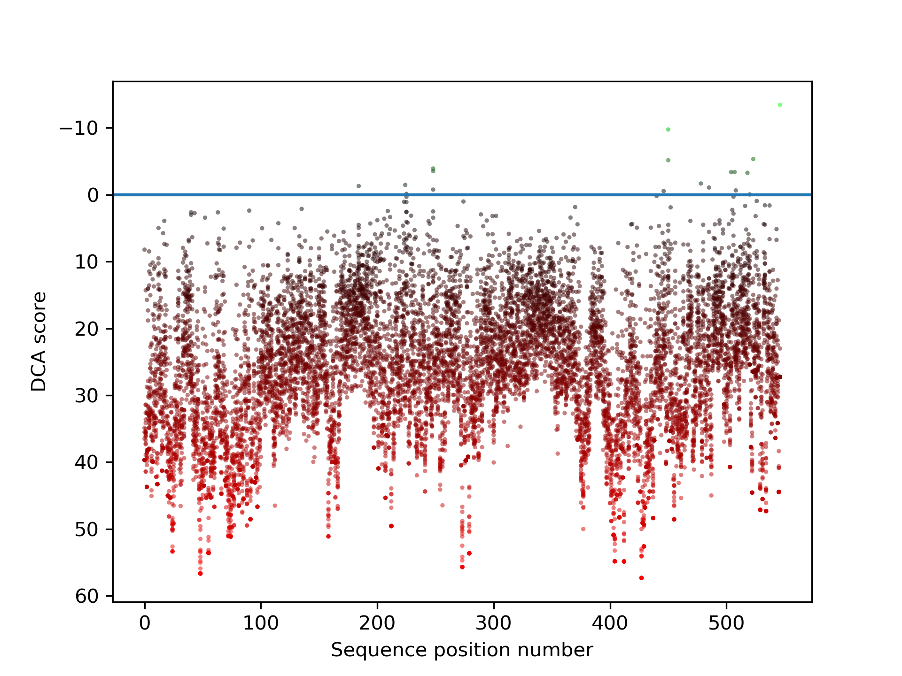
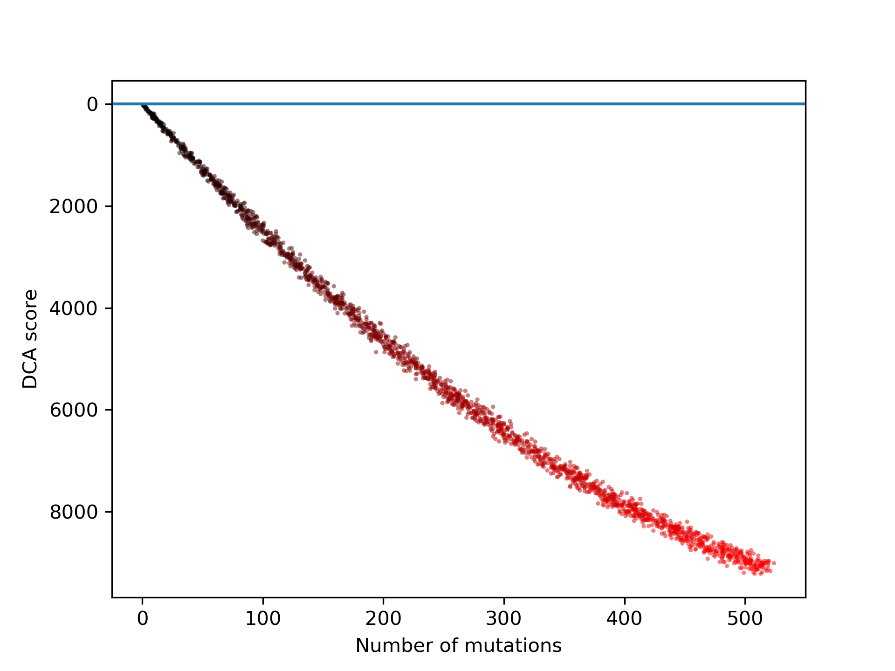
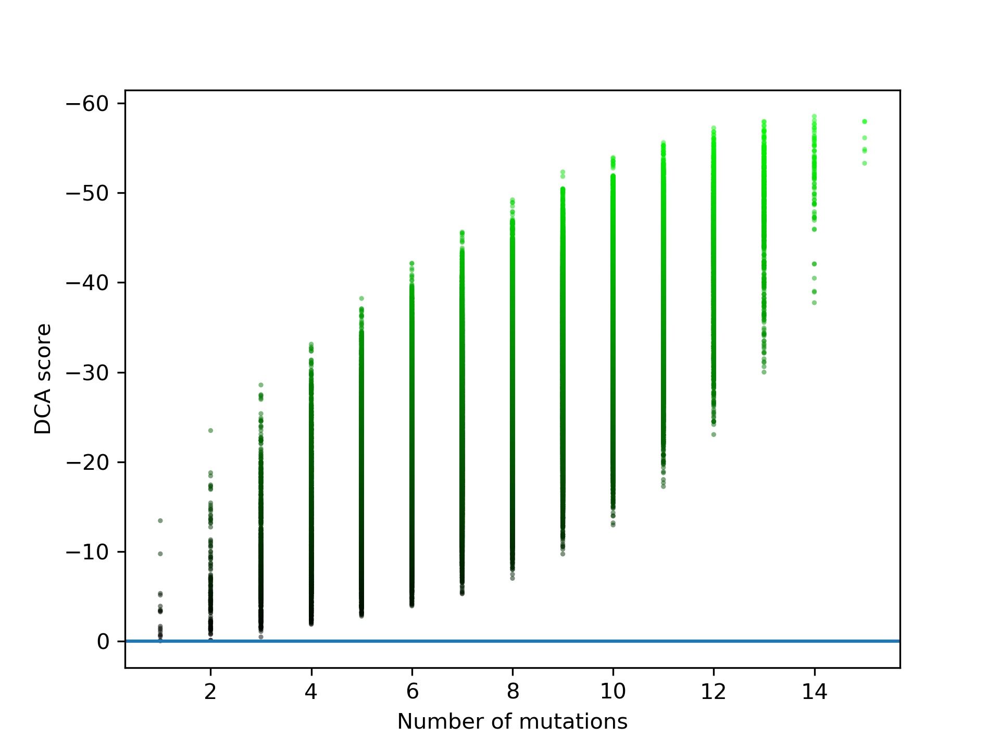

# DCA sequence scoring
## Introduction
The function of proteins is determined by their amino acid sequence. Mutations in this sequence don't radically change 
the function, but still alter the protein's properties. Some mutations improve some properties, some are detrimental.

The space of all possible mutations is vast, but evolution has filtered them for us. Sequence alignments allow us to
use this information:
A sequence alignment is a collection of related sequences, aligned in a way to highlight their mutations.
From this alignment it is possible to statistically determine the "evolutionary fitness" of a protein sequence.

DCA is a statistical model that not only uses single column frequencies, but also pairwise mutations
and can therefore paint a more accurate picture of the interrelatedness of mutations.

See these paper for more details on the method:
```
M. Figliuzzi, H. Jacquier, A. Schug, O. Tenaillon, M. Weigt (2015), 
"Coevolutionary landscape inference and the context-dependence of mutations in beta-lactamase TEM-1",
Mol. Biol. Evol.
```
```
E. De Leonardis, B. Lutz, S. Ratz, S. Cocco, R. Monasson, A. Schug, M. Weigt (2015),
"Direct-Coupling Analysis of nucleotide coevolution facilitates RNA secondary and tertiary structure prediction",
Nucleic acids research, 43(21), 10444-55. 
```
## Usage
### Basic DCA scoring
```python
from dca import DCAScoreGen
from utils.sequence_utilities import to_int

dca = DCAScoreGen(alignment_file_FASTA_format)

sample_sequence = "MYTVGDYLLDRLHELGIEEIFGVPGDYNLQFLDQIISRKDMKWVGNANELNASYMADGYARTKKAAAFLTTFG [...]"
score = dca.score(to_int(sample_sequence))
```
Storing the DCAScoreGen instance as a pickle file is recommended to save future computation time.
### Large scale DCA scoring
```python
from dca import DCAScoreGen
from utils.sequence_utilities import to_int
import numpy as np

dca = DCAScoreGen(alignment_file_FASTA_format)

sample_sequence_batch = np.array([to_int(seq) for seq in sample_sequence_batch])
scores = dca.score_gpu(sample_sequence_batch)
```
The GPU implementation of the scoring function calculates up to 256 * 256 = 65536 sequence scores at once.
To be able to use it, the conda package "cudatoolkit" is necessary.

Windows users might experience errors when not disabling TDR, which restarts the graphics drivers when kernels take 
longer than 2 seconds. Use utils/disable_TDR.reg and restart to disable it. As alternative, the option to increase the
time until triggering also exists.
## Experiment usecases
The aim of the experiments was to find mutations that improve properties of the initial sequence.
Due to the vast possibility space of this problem multiple approaches were taken.

All experiment scripts lay in the "experiments" folder. Simply start them by invoking the scripts. 
Resulting plots will appear in the folder "plots".
```bash
cd experiments
python investigate_single_mutations.py
```
The experiments use an alignment which was created by searching for homologues to a sequence of the enzyme KIVD.
The alignment uses the FASTA format and is provided in the folder "sample_data".

 
### All possible single mutations
All sequences with one mutation to the initial sequence were scored. Only a minority of mutations is deemed beneficial.


### All possible double mutations
The GPU implementation of the scoring function makes it possible to score all 59,732,400 double mutations under four hours.
Dividing the resulting score of each sample by the sum of the scores of their comprised single mutations yields a synergy coefficient.
The highest synergy coefficient for each position pair is plotted in this heatmap:  


### Monte carlo method of sequence generation
Randomly sampling all possible mutations gives us a picture of the overall trend for multiple mutations:


### All combinations of all beneficial mutations
The subset of all single mutations with negative DCA score and therefore deemed beneficial is small enough that it
is feasible to calculate the scores of all their possible combinations:
